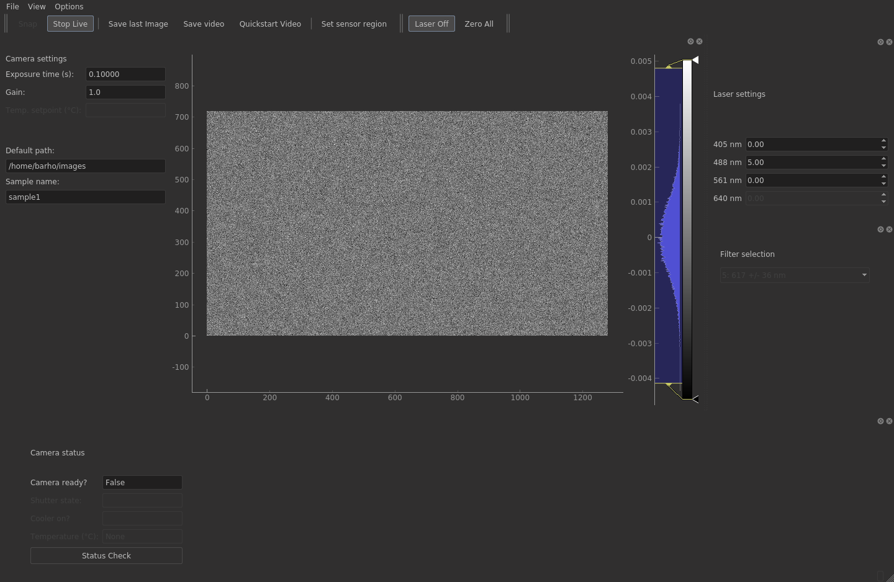
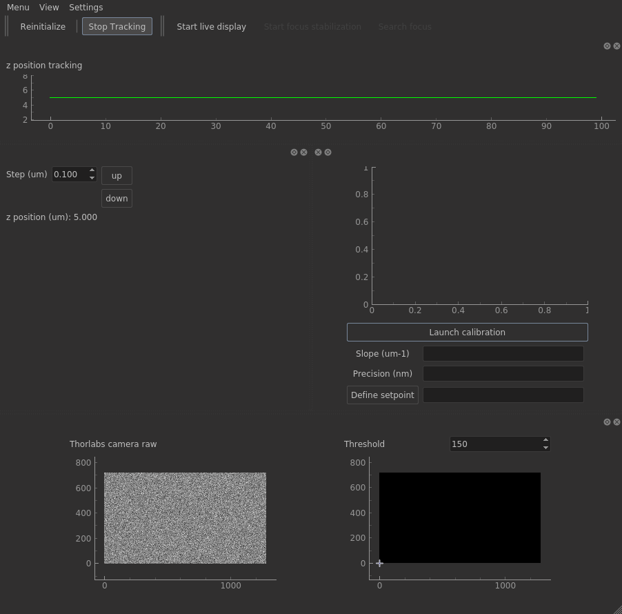
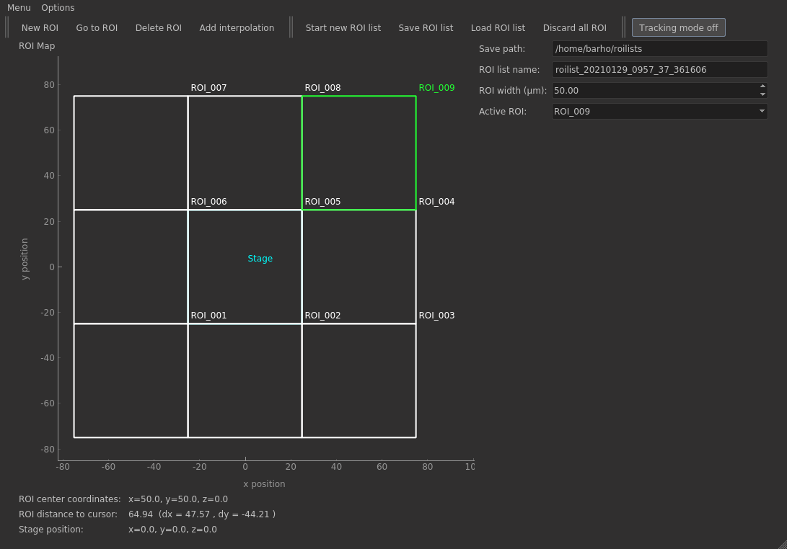
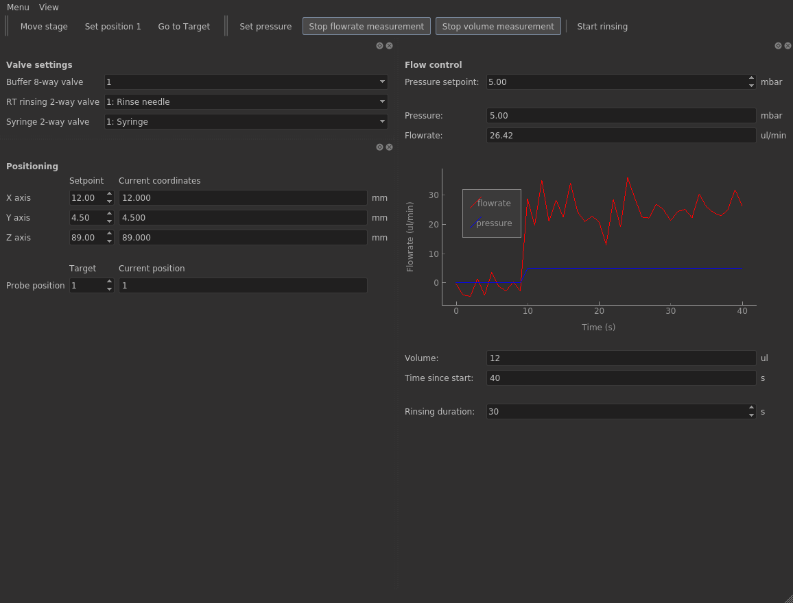
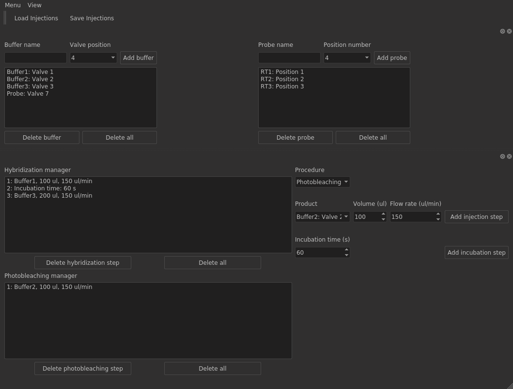
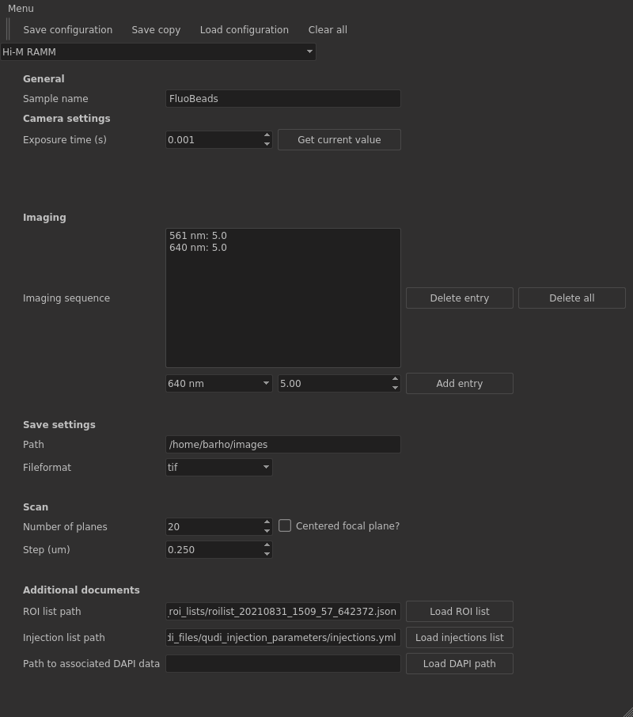
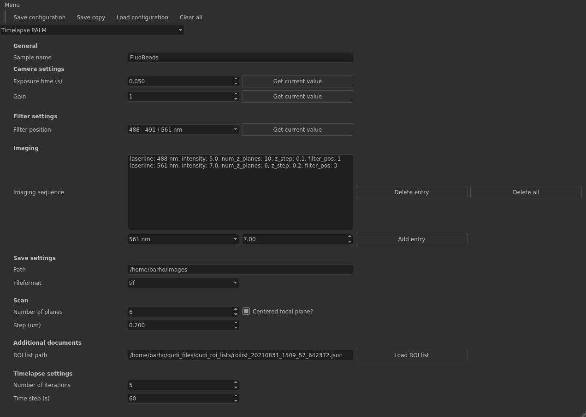

# Qudi-CBS User Guide

## Starting Qudi-CBS

### Linux: 

Open a terminal and activate the conda environment named qudi: 

`conda activate qudi.`

Navigate to the folder qudi-cbs: 

`cd /home/user/qudi-cbs` 

Run the start.py script: 

`python start.py`

### Windows: 

Double-click on the desktop shortcut (Diamond shaped symbol and name Qudi-cbs).

[alternative way if desktop shortcut is not available: Start a Python IDE, for example PyCharm. Open the project folder qudi-cbs. This ensures that you are running the right conda environment and Python interpreter version. Open the file .\qudi-cbs\start.py and execute it.]

## The Manager Module

On start, the manager GUI opens. It contains three sub-windows: The module manager in the upper left part, an interactive Python console in the upper right part and the logger in the lower part. 

The module manager gives access to all modules available for the experimental setup you are using. Modules are organized into three categories, corresponding each to a tab in the module manager section: GUI, Logic, and Hardware. You will mainly be concerned with GUI modules and eventually hardware modules in case it is preferred to check which devices are connected. 

The logger keeps track of the events happening during program execution. Info messages are displayed in green, warnings in yellow and errors in red. Errors are additionally displayed in a pop-up message box. When successfully loading new modules, and in case of important successful user actions, an info message is displayed. Warnings typically appear when a user action is not available on the setup, or if a non-critical configuration value is missing. 

#### Loading modules

The module manager allows to load the modules that one wants to use. As default, modules are not loaded on start. 

Before loading a module, make sure that the devices are switched on, otherwise module loading will fail and you will be informed by an error message. (But you can start the computer and the software Qudi-CBS before switching on the devices, there is no particular order to respect.)

To load the module, click on the corresponding button in the upper left section of the manager GUI. All dependencies of your module will also be loaded, i.e. if you load the Basic Imaging GUI, required hardware modules such as the camera module will also be activated.

## Qudi-CBS GUI modules

### General organization of Qudi-CBS GUI modules

Most Qudi-CBS GUI modules contain the following elements: The menubar with at least the entries 'Menu' or 'File' and 'View', eventually an 'Options' menu, toolbars containing action buttons for the most important user interactions, and the main area which is typically organized into so-called dockwidgets. Dockwidgets are subwindows can be detached and moved around, or they can be hidden if they are not useful for your current experiment. To make them again visible once they have been closed, use the 'View' menu and check the hidden dockwidget. If you hide a dockwidget, the other ones will scale up to fill the available space on your screen. This can notably be helpful to enlarge camera images. Actions in the *Menu* (*File*) and the *View* menu will not be described individually for each module, as they are nearly the same for all modules.

 

### Basic Imaging GUI 

This module contains the basic tools for sample visualization, such as camera image and settings, camera status control, control of the light sources, and of the filters, if applicable. Image data (single image or video) can be saved using the different tools on this GUI. 

Available on: 

- PALM
- RAMM
- Airy-scan (*only for the laser control*)

Required devices:

- Camera
- Laser controller (DAQ or FPGA)
- Filterwheel or information about single multiband filter
- optional: White light source controller

The following table gives an overview of the connected devices. 

| Setup    | Camera                        | Laser controller                       | Filterwheel                                                  | White light source controller |
| -----    | ----------------------------- | -------------------------------------- | ------------------------------------------------------------ | ----------------------------- |
| PALM     | Andor iXon Ultra emCCD camera | National Instruments DAQ m series 6259 | Thorlabs 6 position filterwheel /  Thorlabs 6 position fast filterwheel | -                             |
| RAMM     | Hamamatsu Flash sCMOS camera  | National Instruments FPGA              | Quad band filter  (placeholder implementation)          | ASI Motor stage 2000          |
| Airyscan | Camera controlled by ZEN      | Celesta Lumencor                       | Not yet installed | Controlled by ZEN |

The following actions are available the Basic Imaging module:

#### Options menu:

- Camera settings:

  - Exposure time 

  - Gain if applicable (only for emCCD)

  - Temperature if applicable (only for emCCD)

  - Frame transfer mode if applicable (only for emCCD)

    Validate new values by clicking on the **OK** button of the dialog box. Closing the dialog via the **Cancel** button or the **Close shortcut** in the upper right corner will reset the precedent settings. 

- Image rotation settings: Check / Uncheck one of the proposed options: 

  - rotation 90 degrees clockwise
  - rotation 90 degrees counter clockwise 
  - rotation 180 degrees. 
    Checking one of these options will automatically uncheck the formerly checked one so that starting point for the rotation is always the default image orientation.

#### Imaging toolbar: 

- *Snap*: Take a single image to be displayed directly. Data is not saved.

- *Live / Stop live*: Start a live visualization of the camera image. Data is only displayed, not saved. 

- *Save last image*: Save the currently displayed image if acquisition is stopped, or the most recent one in the camera memory during live mode. 
  The save path is defined by the elements default path and sample name on the GUI: default_path/current_date_as_YYYY_mm_dd/sample_name/num_Image/image.tif
  Acquisition parameters are saved as default_path/current_date_as_YYYY_mm_dd/sample_name/num_Image/parameters.txt

- *Save video*: Open a dialog box to define settings for a video acquisition.  

  - A complete save path is proposed based on the default save path and the sample name on the GUI, but can be modified. 

  - File formats tiff and fits are available. For tiff formats, the acquisition parameters are saved in a separate txt file. For fits, acquisition parameters are included as metadata in the header of the fits image data file. 

  - Select the number of frames to save or a total acquisition time. For the latter, the corresponding (integer) number of frames will be calculated automatically. 

  - Display during acquisition can be activated using the enable display checkbox. 

    Validate this dialog with **OK** to start saving the video. **Cancel** or click on the **close shortcut** resets default values. Image data and acquisition parameters are saved to default_path/current_date_as_YYYY_mm_dd/sample_name/num_Movie/movie.tif or .fits and  default_path/current_date_as_YYYY_mm_dd/sample_name/num_Movie/parameters.txt if image data is saved in tiff format.
    [depending on the setup, data transfer is handled differently: data is spooled to disk during acquisition on PALM setup which allows to acquire sequences with many frames.]

- *Quickstart video*: This is a shortcut that can be used instead of opening the *Save video* dialog and validating with OK. The parameters from the last validated video acquisition are reused. Data is saved with an incremental prefix. 

- *Set sensor region/ Reset sensor region to default*: Reduce the total sensor size to a region of interest to speed up imaging and reduce the amount of data. / Reestablish default sensor size.

#### Lightsource toolbar:

- *Laser on / off*: Switch the laser output on / off, applying the intensity in per cent of maximum intensity defined in the fields next to the wavelength label in the lightsource dockwidget (see below). 
- *Zero all*: Set all intensities to zero.
- *Brightfield on / off* (not available on PALM setup): Switch the white light source on / off, using the intensity in per cent of maximum intensity defined next to the brightfield label in the lightsource dockwidget. 

#### Camera dockwidget:

This principal dockwidget displays current camera settings and the camera image with intensity scale bar. Editable fields are the default path and the sample name. To modify the camera settings, use the options menu --> camera settings dialog. You can pan and zoom into the camera image. To reset the default size, hover the cursor close to the lower left corner of the camera image, a symbol 'A' will appear. 

#### Lightsource dockwidget: 

Use the fields to define the intensity in percent of maximum intensity that will be output to the corresponding lightsource when using *Laser on* or *Brightfield on* buttons in the laser toolbar. If laser / white lightsource is already on, modifying the intensity has an immediate effect. One should observe a change in brightness when changing the intensity value.

#### Filter dockwidget:

Select an emission filter from the dropdown menu to move it into the beam path. Depending on your selection, some lightsources in the laser dockwidget might be forbidden and will be disabled. The logger on Qudi's manager GUI will inform you that the filter has been changed. The filter selection dropdown menu is disabled when lasers are on. Click first the *Laser Off* button to make it again available.

#### Camera status dockwidget

The displayed fields inform you about the camera status, such as is the camera ready for an acquisition, is the mechanical shutter open if applicable, is the cooler on if applicable, and the sensor temperature if applicable. Update of these fields is not automatic. Click the *Status Check* button to update the information. 

#### 

### Focus Tools GUI 

This module contains the tools to focus your camera image displayed in the Imaging GUI window. Focus can be set manually or by using the autofocus tools. The autofocus needs a calibration before it is possible to use it. Autofocus functionality is implemented using different instrumentation on the experimental setups.

Available on: 

- PALM 
- RAMM

Required devices:

- Piezo controller
- Camera (control of the NIR laser reflection)
- optional: FPGA
- optional: 3 axes stage 

The following table gives an overview of the connected devices. 

| Setup | Piezo controller         | Camera       | FPGA    | 3 axes stage         |
| ----- | ------------------------ | ------------ | ------- | -------------------- |
| PALM  | Physik Instrumente PIFOC | Thorlabs DCx | -       | -                    |
| RAMM  | MCL Nanodrive            | Thorlabs DCx | NI-FPGA | ASI Motor stage 2000 |

The following actions are available:

#### Settings menu:

- PID settings: Open a dialog to modify the parameters for the proportional-integral-differential (PID) stabilization of the focus position. 
- Offset settings : Open a dialog box to indicate previous values for the offset and the autofocus setpoint. This option is only available for the RAMM and should be used only as a **rescuing option for the autofocus parameters after a crash**.
#### Manual focus toolbar:

- *Reinitialize*: Move the piezo stage gradually to the initial position defined in the setup specific configuration file. The movement can be monitored by the displayed z position in the manual focus dockwidget or in the timetrace, if activated. 

- *Start tracking / Stop tracking*: Activate or deactivate the timetrace. This allows to track the current position of the piezo stage over time, if activated. 

#### Autofocus toolbar: 

- *Start live display / Stop live display*: Start / stop the displaying of the camera image that detects the reflection of the IR laser. If the focus is approximately set, a bright spot should appear in this image. On PALM setup, the autofocus settings are based on the measurement of the position of the IR laser spot. On RAMM setup, it is only a visual help for the user. The autofocus setting is done using the reflection of the IR laser on a quadrant photodiode (QPD).  The QPD signal is measured and processed by the FPGA. 

  

  The following buttons are disabled until an autofocus calibration was performed (see below in the description of Autofocus dockwidget)

- *Start focus stabilization / Stop focus stabilization*: Start a feedback loop to maintain the focus while moving the sample using the translation stage. The piezo position is regulated to maintain the setpoint that needs to be defined before this mode can be used. In case of too rapid movement the signal can be lost. The logger in Qudi's manager GUI will inform you if the signal was lost, and the *Stop focus stabilization* button will automatically set back to its default state (*Start focus stabilization*)

- *Search focus*: Start the autofocus feedback loop until the setpoint is reached and the signal is stable. The process will then automatically stop. As an example, running the *Search focus* functionality while being out of focus will bring the image back in the focus. Depending on the setup, the signal is found differently: If a 3 axes stage is available, a reference plane at a distance *offset* below the sample surface can be used to find the autofocus signal. This is useful if the sample surface strongly perturb the IR reflexion. This offset needs first to be defined. The *Search focus* button is then available and will start a vertical displacement of the 3 axes stage. Once the signal is found, the stage moves back to bring the sample surface into focus. For 2 axes stages, offset defaults to 0.  

#### Manual focus dockwidget

This dockwidget contains a field to enter the step by which the piezo stage will be moved when clicking the up / down buttons. Maximum step size is limited to 1 um. A display area shows the current position of the piezo. Instead of clicking on the up / down buttons, arrow up / arrow down on the keyboard can be used as shortcut and can be hold down permanently. Make sure that the Focus tools window is the active one when using the keyboard shortcuts. 

#### Timetrace dockwidget

This area displays the piezo position over time. Use the corresponding action button in the manual focus toolbar to start the timetrace. The y axis will automatically scale to the range of movement. 

#### Autofocus dockwidget

The **launch calibration** button in the autofocus dockwidget allows to perform the necessary calibration before the autofocus can be used. The piezo is performing a 2 µm ramp around its initial position with 100 nm step. The IR laser reflection signal is measured for each position of the piezo and a linear fit is performed. When calibrated, the slope of the linear fit is displayed next to the corresponding label, and the precision is calculated and displayed on the GUI.

When clicking the **setpoint** button in the autofocus dockwidget, the X/Y position of the IR reflection measured by the QPD is stored in memory and will be used as reference for the autofocus. For the camera based method, the centroid position of the IR reflection will be used instead. 

The **find offset** button allows to calibrate the z axis offset if the reference signal is measured at the lower surface of the sample holder glass slide. This method is adapted for samples that strongly perturb the IR reflection signal. This autofocus mode is used locally when the target position is reached, not while navigating the sample surface in the xy plane. The offset calibration is available only on experimental setups with a 3 axis translation stage. The calculated offset from this calibration corresponds to the thickness between the current plane in the sample and the bottom surface of the glass slide. Offset defaults to 0 on systems with a 2 axes stage.

#### Camera image display dockwidget

This dockwidget contains the display of the camera that measures the signal from the reflection of the IR laser. Use the action button **Start live display** in the autofocus toolbar to start displaying the camera image. Optionally, a thresholded image of the original one is shown (hidden by default on setups where the autofocus is controlled by the signal on the QPD and the camera only serves as visual support). The threshold value can be modified by changing the value in the threshold spinbox. 

### ROI Selector GUI

This module allows to navigate the sample with the translation stage and create lists of regions of interest (ROIs). An overview of all defined ROIs with their position in the xy plane is shown, together with the current stage position. 

Available on: 

- PALM
- RAMM
- Airyscan

Required devices:

- Motorized stage (2- or 3- axes)

The following table gives an overview of the connected devices. 

| Setup    | Motorized stage        |
| -------- | ---------------------- |
| PALM     | ASI MS 2000 - xy axes  |
| RAMM     | ASI MS 2000 - xyz axes |
| Airyscan | ASI MS 2000 - xy axes  |

The following actions are available:

#### Options menu:

- Mosaic scan: A settings dialog allows to define of a grid of adjacent ROIs. 

  - The current stage position or user defined coordinates of the stage can be used as origin of the grid. This origin corresponds to the center position of the grid. 

  - A predefined number of ROIs is created, use the radio button to select the number which is required. 

  - If there are already some ROIs defined in the current list (see below), the mosaic can either be added to this list, or a new list is started (which will discard the former one if it has not yet been saved). 

    Validate the dialog with **OK** to create the mosaic, or click **Cancel** or the **Close shortcut** in the upper right corner of the dialog to discard your mosaic settings. 

#### ROI toolbar: 

- *New ROI*: Add a ROI at the current stage position. It will be appended to the content of the Active ROI dropdown menu on the right-hand side of the main window and will be the currently active one. 
- *Go to ROI*: Move the stage to the active ROI which can be selected from the Active ROI dropdown menu. 
- *Delete ROI*: This action deletes the currently active ROI (i.e. the one selected in the Active ROI dropdown menu). The first ROI in the list will become the new active ROI. 
- *Add interpolation*: This is an easy way of defining many ROIs over a larger area in one click. The current ROI list needs to contain at least two ROIs. The interpolation will fill all the space between them, or the space between the extremal x y coordinates if there are more than two ROIs, with as many ROIs as needed to cover this area. If a large area has already been explored, use this function with caution because many ROIs are generated. Updating the ROI overview display might be slow. 

#### ROI list toolbar:

- *Start new ROI list*: A new list is created, discarding all ROIs of the previous list (which are definitely lost if the list has not yet been saved). A default name roilist_YYYYmmdd_hhmm_ss_uniquenumber is proposed. The default name can be modified.
- *Save ROI list*: The current list is saved to the destination specified in the field *Save path* on the GUI, where a default location is proposed. The default location can be modified, but it is recommended to use it or append a private folder for your lists to this common save path. The logger on the Qudi manager GUI will inform you that the list has been saved. 
- *Load ROI list*: Open a dialog to select an already saved ROI list, looking in the default location. Choose a file that has been generated by the ROI selector GUI to make sure that it contains all necessary information to display it. 
- *Discard all ROI*: Clear all ROIs from the current list but keeping the current name of the list. 

#### Stage toolbar:

- *Tracking mode / Tracking mode off*: Activate / Deactivate position tracking of the stage. The stage marker displayed in the ROI overview area will start moving around according to the physically performed movement of the ASI stage, if activated. 

#### Main window area:

The main window area contains the ROI overview area (ROI map) indicating the positions of the already defined ROIs as white markers, respectively green marker for the active ROI. The stage position is also indicated by a cyan-colored marker. Below the ROI map, indicators of the center positions of the current ROI and the stage are shown, an a distance measurement from the cursor position on the ROI map to the center of the active ROI is displayed. On the upper right part of the main window, editable fields for the default save path, the ROI list name, the size of the ROI marker (which by default corresponds approximately to the field of view on your setup) are available. The dropdown menu contains a list of all defined ROIs. To activate one of them, select it from this dropdown. 

A typical workflow using the ROI selector GUI would be the following: 

- Start a new ROI list
- Switch on the stage tracking mode
- Navigate around on your sample using the ASI stage joystick and add ROIs to your list or delete the ones you don't need 
- Verify ROI list name and save path 
- Save the list
- Switch off the stage tracking mode

**future improvements planned for this module: overlay with compressed images if already acquired to construct a large overview map**

### Fluidics GUI

This module allows to manually handle all devices that are needed to control the injection of buffers and probes. It is also required to validate several settings in this module before an automated experiment (*Task*) can be performed.

Available on: 

- RAMM
- Airyscan

Required devices:

- Valve positioner

- Flowrate sensor 

- Pump for injections

- 3 axes translation stage (for the positioning of the needle in probes)

- Pump for needle rinsing

  

The following table gives an overview of the connected devices. 

| Setup    | Valve positioner                                       | Flowrate sensor                 | Pump for injections                                      | 3 axis translation stage | Pump for needle rinsing                                  |
| -------- | ------------------------------------------------------ | ------------------------------- | -------------------------------------------------------- | ------------------------ | -------------------------------------------------------- |
| RAMM     | Hamilton Modular Valve Positioner (x 3 in daisy chain) | Fluigent Flowrate sensor   | Fluigent MFCS-EZ                                    | PI stage (x y z axes)    | Peristaltic pump controlled by NI-DAQ                    |
| Airyscan | Hamilton Modular Valve Positioner (x 2 in daisy chain) | Fluigent Flowrate sensor        | Peristaltic pump controlled by Measurement Computing DAQ | PI stage (r phi z axes)  | Peristaltic pump controlled by Measurement Computing DAQ |

On start of the fluidics module, validate the reminder message box to remove the needle cover (if done).

The following actions are available:

#### Positioning toolbar:

- *Move stage / Stop moving*: Move the 3 axis stage with the injection needle to the specified coordinates. 

  - Movement is first done to the z safety position, then in the xy plane, and, once reached, back to specified z coordinate. 
    The allowed range of z positions for manual positioning is limited to the range above the safety position which is predefined for your setup to avoid moving the needle down while not being above a hole in the probe tray. Accessing the probes is only possible by the *Go to Target* action for safety. 
  - During movement, the button is in a checked state and displays the message *Stop moving*. Clicking it again interrupts the movement smoothly. The current coordinates at stop are displayed in the positioning dockwidget area.

- *Set Position 1*: Open a dialog to set the xyz coordinates corresponding to the position no. 1 on the probe tray. 

  Proposed default values correspond to 2 ul Eppendorff tubes. Modify and/ or validate the values by clicking the **OK** button in the dialog. If the **Cancel** button or the **Close shortcut** is clicked, position 1 is not set or is not updated if it was already set previously. 

- *Go to Target*: This button is available after position 1 has been defined. Allows to navigate to a target position by indicating the number on the probe tray. The target position is indicated in the corresponding field on the positioning dockwidget. As with the move stage button (see above), a smooth stop of the stage can be done while the stage is moving. 

#### Flowcontrol toolbar:

- *Set pressure*: Apply the pressure value defined in the corresponding field on the flowcontrol dockwidget. 
- *Start flowrate measurement / Stop flowrate measurement*: When activated, the current pressure value (which can differ from the setpoint due to inertia) and  the current flowrate are regularly measured and displayed on the GUI as values and also graphically over time. The graph displays the last 100 acquired pressure and flowrate values. Click this button again to stop the update of the displayed values and stop the graph. When restarting the measurement mode, old values displayed in the graph are discarded.  
- *Start volume measurement / Stop volume measurement*: By clicking this button, a volume count can be started when injecting a buffer or probe using the Fluidics user interface. Additionally, the time in seconds since start of the volume count mode is displayed. The user must take care to start the volume count at a convenient moment, for example after setting the valves to allow an injection or after applying a pressure. Such an injection will not automatically stop. In case an injection with more precise control is desired, the fluidics task should be preferred. 
- *Start rinsing / Stop rinsing*: Valves are set to the positions required to rinse the needle, if not yet done by the user. Then, the peristaltic pump which pumps a liquid through the needle used for probe injection is activated. A duration for the rinsing process can be predefined using the corresponding field on the GUI. The pump will then stop after this duration. It is also possible to stop the rinsing manually by clicking again the *Stop rinsing* button. 
  **Valve setting not yet operational on both setups** 

#### Valve settings dockwidget:

The dropdown menus for the valve controllers available on the setup allow to manually set the target positions. Select the position from the dropdown to start rotating the valve controller to the specified position. The logger on Qudi's manager GUI will inform you of the valve thats position has been changed.

#### Flowcontrol dockwidget:

This dockwidget contains an editable field for the pressure setpoint. The fields labeled pressure and flowrate correspond to measured values. To update their content, activate the flowrate measurement mode by clicking the Start Flowrate Measurement button in the flowcontrol toolbar. The graph displayed the last stored pressure and flowrate measurment values. The volume and time since start fields on the GUI indicate the total volume after starting the volume measurement mode, and the corresponding time. The rinsing duration can be predefined by editing the corresponding field on the GUI. 

#### Positioning dockwidget:

Positioning of the injection needle can be done by either specifying the target xyz-coordinates setpoint, and then starting the movement to this location by clicking the *Move stage* button in the positioning toolbar. However, the z movement is limited for safety. The alternative and safer way is to specify the target probe position on the probe tray. For this, it is required to define the position 1 using the *Set Position 1* button in the positioning toolbar. After this calibration, a target position can be selected and the movement can be started by clicking the *Go to Target* toolbutton. 

### Injections GUI

This module allows to define an injection sequence for hybridization and photobleaching processes, used either in the fluidics task or in the Hi-M task (see taskrunner module below).

Available on: 

- RAMM
- Airyscan 

Required devices: None

The following actions are available:

#### File toolbar:

- *Load injections*: 
  - Opens a dialog that allows to select a file containing already defined hybridization and / or photobleaching sequences, including the definitions which buffers are connected on which valve outlets and the probe names with their respective position. 
  - The default location where injection files are saved is proposed by the dialog but you can navigate to a personal folder containing your lists if applicable. Once the file loaded, you can edit all information and save it under a new or the same name (see next point).
- *Save injections*: 
  - Opens a dialog that allows you to create or select a file where you want to save your configured injection sequences. The logger in the Qudi manager GUI will inform you that your file has been saved.

#### Buffer and probes dockwidget:

Before defining the injection sequence, it is required to add the buffers that will be available for the injection. For this, add a valid name in the field *Buffer name*, select the valve outlet where it is connected and add it to the buffer list. To delete an entry from this list, select it in the display area and click the *Delete buffer* button underneath the display area. To discard all entries (except the default entry of the valve outlet where the probe is connected on the setup), click the *Delete all* button. Proceed in an analogous way to define the probes, using the *Add probe*, *Delete probe* and *Delete all* buttons, in the right part of the dockwidget. 

#### Injections dockwidget:

The injection dockwidget contains the tools to define the hybridization and photobleaching injection sequences. First, select the procedure you want to define from the *Procedure dropdown* ('Hybridization' or 'Photobleaching'). All the buffers that are defined above in the buffer dockwidget are available in the *Product dropdown*. Select the product, indicate the desired volume and flowrate and add this entry to the list by clicking the button *Add injection step*. To add an incubation step, indicate the time and click the *Add incubation step* button. To discard a single entry from the list, select it and click the *Delete hybridization step* button. To reset the complete list, click the *Delete all* button. New entries are always appended to the list, insertion is not possible. Proceed in a similar manner to define the photobleaching sequence. Remember to save your data (see toolbar: Save injections).

<u>**Important for the RAMM**</u> : 
- Regarding the probes positions numbers, there is no need to start at 1 and/or keep incrementing in ascending order by step of 1. You can indicate the probes positions in the order you want (2,5,11,3, etc.) 
- For the Hybridization manager, you can call **Probes** several times. For the first call, the needle will be at the position indicated in the probe list. Then, for each new call, the needle will move to the next position on the tray. For example, a Fiducial tube is in position #1 and a DAPI tube in position #2. An example of hybridization injection could then be :
  - Probe,1500ul,150ul/min = the needle is in position #1 and injection of fiducial
  - Injection of wb
  - Probe,1500ul,150ul/min = the needle move to position #2 and injection of DAPI
  - Injection of ssc
  - Injection of ib

### Experiment Configurator GUI

This module allows to prepare an experiment that can then be started using the Taskrunner (see next section). The aim is to indicate all relevant user parameters that are needed to perform an experiment. 

Available on: 

- PALM
- RAMM
- Airyscan

Required devices:

The same as for Basic Imaging GUI (so that the currently set values can easily be retrieved):

- Camera
- Laser controller (DAQ or FPGA)
- Filterwheel or information about single multiband filter

The following table gives an overview of the connected devices. 

| Setup    | Camera                        | Laser controller                       | Filterwheel                                         |
| -------- | ----------------------------- | -------------------------------------- | --------------------------------------------------- |
| PALM     | Andor iXon Ultra emCCD camera | National Instruments DAQ m series 6259 | Thorlabs 6 position filterwheel                     |
| RAMM     | Hamamatsu Flash sCMOS camera  | National Instruments FPGA              | Quad band filter  (placeholder implementation) |
| Airyscan | -                        | -                                 | Quad band filter  (placeholder implemetation)  |

The following actions are available:

#### File toolbar:

- *Save configuration*: After selecting your experiment type and defining all required entries (see below), this button allows to save the configuration to a default location where the Taskrunner (see next section) will retrieve its information to perform an experiment. In case a necessary entry is missing, the logger in the Qudi manager GUI will warn you about the missing value. The configuration cannot be saved unless all required data is available. 
- *Save copy*: Allows to select a destination and filename to save a backup of your current experiment configuration. 
- *Load configuration*: Open a dialog to select an already saved experimental configuration file, either from the default files or one of your backup files. The corresponding experiment type is automatically selected and the adapted configuration form is displayed. If not all needed parameters can be found in your file, the corresponding fields are empty after loading.
- *Clear all*: Reset all fields in the experiment configuration form to default values. 

#### Main window area:

The main window area contains on start of this module a dropdown menu with all available experiments for your setup. Select the one that you want to configure. A form opens up that contains all required information needed to perform the corresponding experiment. You can retrieve current settings from the devices by clicking on the **Get current value** buttons next to the fields, if applicable. 

To define an imaging sequence, select the light source from the dropdown menu below the imaging list area, define the intensity in percent of the  intensity and add this entry to the list. The entries will be listed in the order in which they are inserted. To delete a single entry, select it in the list and click the **Delete entry** button. To discard the entire list, click the **Delete all** button. 

For timelapse experiments (available on PALM and RAMM setup), the entries in the imaging sequence consist of the lightsource, the intensity, the number of planes in a z stack, the spacing in a z stack, and eventually the emission filter for the lightsource. This allows to perform stacks with different parameters for different laserlines. 

If you define an imaging experiment using a z stack, you have the option to start at the current plane or to place this current plane in the middle of the scan (option **Centered focal plane** checked). 

To retrieve the full path to your ROI list and / or an injection sequence, use the corresponding **Load list** buttons, which will open up a file selection dialog proposing the default location for the file type in question. In case of Hi-M experiments, it is also possible to indicate the path to the associated data after the DAPI injection. This can be used for interactive data visualization in the experiment tracker app.

The following image illustrates the Experiment Configurator GUI for the Hi-M experiment, the subsequent one for the Timelapse experiment.

### Taskrunner

This module allows to run experiments available on your experimental setup. All experiments require a parameter file that needs first be configured using the Experiment configurator module (see section above).

Available on: 

- PALM
- RAMM
- Airyscan

Required devices:

Depending on your experiment. Unconnected devices will produce an error when loading this module, i.e. some experiments will not be loaded in the list of available ones. You can nevertheless run all other experiments that were loaded completely. 

The following actions are available:

#### Toolbar:

- *Start*: Start the selected experiment / Resume the experiment if it is paused
- *Pause*: Pause the selected experiment
- *Stop*: Stop the experiment, it can not be resumed
- *Abort*: Bring the experiment to an emergency stop. This button should only be used in Fluidics and Hi-M tasks, where the waiting time until the next iteration may be long. All other experiments can reasonably well be stopped using the *Stop* button. It may happen that a warning message appears after aborting an experiment. 

#### Main window area:

The main window area displays a table with the available experiments (called 'Tasks' in Qudi). 

To start a task, select its name in the first column of the table. The action button **Start** in the toolbar will then become available. If no experiment is selected, the action buttons are not callable, because the program requires the information which task shall be started and this is only guaranteed if there is one (and only one) selected. Make sure you have defined your user parameters for the experiment you want to perform previously using the experiment configurator GUI (cf. previous section). To double check, you can reload the file in the experiment configurator or open it with a text editor of your choice. If everything is correctly defined, start the experiment. 

Experiments can be paused or stopped. For this, click again on the name of the experiment in the first column of the displayed table. When the selected experiment is already running, the **Pause** and **Stop** button in the toolbar will be available. Note however, that these actions do not take effect immediately but only after finishing the current step in your experiment. One step is typically defined as the smallest complete unit that will be repeated in an experiment, so it can be quite short in simple experiments, but may also correspond to one cycle in the case of an Hi-M experiment. The stop button is hence not an emergency stop. When paused, the experiment can be resumed from the step it reached when transitioning to pause. 

It is important to select the experiment on which you want to act by clicking on the entry in the displayed table, as it is in principle possible to perform different experiments in parallel (though in practice not applicable because this will lead to conflicts regarding the hardware). So you must give the information which experiment you are addressing. 

The second column in the table of available experiments displays their current state (such as starting, running, paused, resuming, finishing, stopped). In the current version, the update of the state is not immediate due to a bug in the underlying update mechanism. To trigger the actualization, hover the cursor over the GUI.  The third and forth column (Pre/Post actions, Pauses) are relevant in the original Qudi software but not in this implementation as experiments will not run in parallel. The column 'Needs modules' lists dependencies of the experiment, which is rather relevant for developers. The last column 'is ok' indicates if an experiment is correctly loaded and can be performed.

The following table lists all available experiments by their names in the Taskrunner and the corresponding name in the Experiment configurator. Moreover, the default file path for the experiment parameters are shown. Parameters can only be loaded from these default files. Before starting an experiment, it is important to verify that this default file contains your parameters.

| Experiment name in Taskrunner           | Setup    | Experiment name in Experiment Configurator | Corresponding experimental configuration file                |
| --------------------------------------- | -------- | ------------------------------------------ | ------------------------------------------------------------ |
| MulticolorImagingTask                   | PALM     | Multicolor Imaging PALM                    | C:\Users\admin\qudi_files\qudi_task_config_files\multicolor_imaging_task_PALM.yml |
| MuticolorScanTask                       | PALM     | Muticolor Scan PALM                        | C:\Users\admin\qudi_files\qudi_task_config_files\multicolor_scan_task_PALM.yml |
| ROIMulticolorScanTask                   | PALM     | ROI multicolor scan PALM                   | C:\Users\admin\qudi_files\qudi_task_config_files\ROI_multicolor_scan_task_PALM.yml |
| TimelapseTask                           | PALM     | Timelapse PALM                             | C:\Users\admin\qudi_files\qudi_task_config_files\timelapse_task_PALM.yml |
| -----------------------------           |          |                                            |                                                              |
| MulticolorScanTask                      | RAMM     | Multicolor scan RAMM                       | C:\Users\sCMOS-1\qudi_files\qudi_task_config_files\multicolor_scan_task_RAMM.yml |
| ROIMulticolorScanTask                   | RAMM     | ROI multicolor scan RAMM                   | C:\Users\sCMOS-1\qudi_files\qudi_task_config_files\ROI_multicolor_scan_task_RAMM.yml |
| FluidicsTask                            | RAMM     | Fluidics RAMM                              | C:\Users\sCMOS-1\qudi_files\qudi_task_config_files\fluidics_task_RAMM.yml |
| HiMTask                                 | RAMM     | Hi-M RAMM                                  | C:\Users\sCMOS-1\qudi_files\qudi_task_config_files\hi_m_task_RAMM.yml |
| PhotobleachingTask                      | RAMM     | Photobleaching RAMM                        | C:\Users\sCMOS-1\qudi_files\qudi_task_config_files\photobleaching_task_RAMM.yml |
| TimelapseTask                           | RAMM     | Timelapse RAMM                             | C:\Users\sCMOS-1\qudi_files\qudi_task_config_files\timelapse_task_RAMM.yml |
| FastTimelapseTask                       | RAMM     | Fast timelapse RAMM                        | C:\Users\sCMOS-1\qudi_files\qudi_task_config_files\fast_timelapse_task_RAMM.yml |
| ----------------------------            |          |                                            |                                                              |
| Multicolor Scan Task Dummy              | -        |                                            |                                                              |
| Hi-M Task Dummy                         | -        |                                            |                                                              |
| Timelapse Task Dummy                    | -        |                                            |                                                              |
| Fast Timelapse Task Dummy               | -        |                                            |                                                              |
| ----------------------------            |          |                                            |                                                              |
| MulticolorScanTask                      | Airyscan | Multicolor scan AIRYSCAN                   | C:/Users/MFM/qudi_files/qudi_task_config_files/multicolor_scan_task_AIRYSCAN.yml |
| ROIMulticolorScanTask                   | Airyscan | ROI multicolor scan AIRYSCAN               | C:/Users/MFM/qudi_files/qudi_task_config_files/roi_multicolor_scan_task_AIRYSCAN.yml |
| Fluidics Task Airyscan                  | Airyscan | Fluidics Airyscan                          | C:/Users/MFM/qudi_files/qudi_task_config_files/fluidics_task_AIRYSCAN.yml |
| Hi-M Task Airyscan                      | Airyscan | Hi-M Airyscan                              | C:/Users/MFM/qudi_files/qudi_task_config_files/hi_m_task_AIRYSCAN.yml |
| Hi-M Task Airyscan for confocal         | Airyscan | Hi-M Airyscan Confocal                     | C:/Users/MFM/qudi_files/qudi_task_config_files/hi_m_task_AIRYSCAN.yml |

## Preparing and running a Hi-M experiment on RAMM setup

In this section, the preparation and execution of a Hi-M experiment is described. In case of doubt on how to use the functionalities of a module, refer to the detailed description above. 

For the Hi-M experiment, you will use all GUIs that are available on the setup. You can either leave all GUI windows open once you have finished your actions on them, or close them using the Menu -> Close action or by clicking the Close shortcut in the upper right corner. The modules are still available and your settings are not lost. They are in an idle state and can simply be brought to the foreground by clicking again on their associated button in Qudi's manager GUI. 

### Step 1: Nuclei staining and fiducial hybridization

#### 0. Check connected drives

If image data is to be saved on a data storage server, make sure that the server is mounted. 

#### 1.0. Hardware

Start all devices as usual. 

#### 1.1. Visualizing the sample

- Load the Focus Tools GUI, so that the piezo is initialized.
- Load the Basic Imaging GUI.
- Start the camera live mode. 
- Set an intensity value for the lightsource you want to use (in % of max intensity) and activate it by clicking on **Laser On** or **Brightfield On**. 
- Position your sample and set the focus, using the joystick and z positioning wheel of the ASI stage. 
- Eventually adapt the exposure time of the camera. 

#### 1.2. Select ROIs

- Load the ROI selector GUI. 
- Start a new ROI list. 
- Start the tracking mode that will allow to follow the stage movement. 
- Explore your sample using the ASI stage joystick and define ROIs on interesting spots by clicking the New ROI button. 
- Save the list when completed, by clicking Save ROI list. 
- Note the name of the list (or it can be found by the timestamp if the default name is used). Its complete path will be needed later to configure the experiment. 

#### 1.3. Define the probe position 1

- Load the Fluidics GUI. 
- Define probe position 1 by clicking the **Set Position 1** button. 
- The dialog window proposes the default values for 2 ml Eppendorff tubes. Modify this, if applicable, and/or validate the values. 

#### 1.4.  Define the injection sequence (DAPI)

- Load the Injections GUI. 
- Define which buffer is connected on which valve position of the 8 way buffer valve, by adding entries to the Buffer list. 
- Define the probe name and its position by adding entries to the Probe list.
- Define the hybridization sequence: Select the procedure 'Hybridization' (default). Select the product from the dropdown menu, specify volume and flowrate and add it by clicking the **Add injection step** button. To add an incubation time, specify the time and click the **Add incubation step** button. 
- When finished, save your injection sequence by clicking the **Save injections** button in the toolbar. Specify the filename and save. Note the name of your injections file, it will be needed later to configure the experiment. 

Instead of defining buffers, probes and the injection sequences from scratch, you can also load an already saved procedure from file. Verify that the buffers are connected at the same positions as specified in your loaded file, modify if necessary. 

#### 1.5. Configure the experiment - DAPI injections 

- Load the Experiment configurator GUI. 
- Select the Fluidics experiment from the dropdown menu. The form will adapt to ask you for all required parameters for this experiment. You only need to specify the path to the defined fluidics sequence. 
- Click the **Load injections list** button and select your file defined in the previous step. (Or an old file if you are sure that it contains the correct specifications.) 
- Save your experiment configuration by clicking the corresponding button in the toolbar. 
  This will overwrite a default file read by the taskrunner (see next step). Make sure that you saved your configuration, otherwise you will be running the injection sequence that a previous user has saved. 

#### 1.6. Running the DAPI injection sequence

- Load the taskrunner.
- Select the FluidicsTask by clicking on the name of the experiment in the first column of the displayed table. The **Start** button in the toolbar is now in a callable state. 
- Start your experiment. 
- You can use the Fluidics GUI to monitor the current flow parameters (pressure, flowrate). 

If the experiment needs to be paused or stopped, select again the FluidicsTask in the list and click the **Pause** or **Stop** button. 

The second column in the table of available experiments displays their current state (such as starting, running, paused, resuming, finishing, stopped). In the current version, the update of the state is not immediate due to a bug in the underlying update mechanism. To trigger the actualization, hover the cursor over the GUI.  

-------------------------------------------------------------------------

Optional steps in between step 6 and 7

#### 1.6.1. Configuring the background fluorescence bleaching experiment

- Open the Experiment configurator GUI.
- Select the Photobleaching experiment from the dropdown menu. 
- Specify all required parameters and save the configuration. 

#### 1.6.2 Running the background fluorescence bleaching experiment

- Open the taskrunner.
- Select the Photobleaching experiment and start it. 
- You can open the ROI selector GUI to monitor the current stage position. This is automatically done. Do not start the tracking mode. 

---------------------------------------------------------------------------

#### 1.7. Configure the experiment - Imaging of all ROIs (z scans)

- Open the Experiment configurator GUI
- Select the experiment ROI multicolor scan from the list.
- Specify all parameters in the form. You can retrieve current settings by clicking the **Get current value** buttons. 
- Save your configuration. 
- Instead of defining all parameters, you may also want to load a previous configuration you have already used, and update the fields that have changed. For this, click the **Load configuration** button and select a file. 

#### 1.8. Calibrate the autofocus

It is now needed to open the shutter of the 785 nm laser.

- Using the Focus Tools GUI:
- [Eventually start the timetrace of the piezo position.] 
- Start the camera live mode that will show the IR laser signal. If the focus is approximately set, you should see a bright spot in the camera image. 
- Focus on a reference plane in the sample, either using the focus **Up** / **Down** buttons or the z positioning of the ASI stage, using as visual feedback the live image in Basic Imaging GUI. 
- [Verify that the piezo position is in a reasonable range, for example between 5 and 70 um]
- Move the stage to perform the calibration near the sample but not on it in case it is a sample that perturbs the IR reflection. 
- Launch the autofocus calibration
- The autofocus setting will be done using the reflection on the lower glass slide - air interface. For this, calibrate the offset by clicking the **Find offset** button. 

#### 1.9. Running the imaging of all ROIs experiment

- Open the taskrunner.
- Select the ROIMulticolorScanTask and start it by clicking on the start button in the toolbar.  

You can monitor the position the stage is currently at, using the ROI selector GUI (without using the tracking mode). The logger in the Qudi manager GUI will inform you when data has been acquired and saved. 

If you want to follow the experiment progress with Bokeh, make sure to manually update the permissions of the folder where the data are saved. To so so :
- click right on the folder and go to properties
- NFS attributes
- check Group/W and Other/W
- apply

### Step 2: RT hybridization cycles 

#### 2.1. Define the injection sequence (RTs)

- Open the Injections GUI. 
- Define the buffers in case they have changed
- Define the list of used RTs. 
- Define the sequences for hybridization and photobleaching. (Refer to step 1.5 above for more details.) 
- Save your injection sequence and note the filename which will be used in the configuration of the experiment. 

#### 2.2. Configure the Hi-M experiment

- Open the experiment configurator GUI 
- Select the Hi-M experiment from the list and enter or verify all required fields. 
- Save your configuration. 

#### 2.3 Running the Hi-M experiment

- Open the Taskrunner.
- Select the HiMTask from the list of available experiments and start it.

Your image data is saved by default to E:\DATA\currentdate_in_format_YYYY_mm_dd\002_him_samplename\005_ROI\scan_002_RT7_005_ROI.fileformat. (example numbers for second experiment, RT7, ROI 005, to be replaced by the corresponding numbers for this step).  
(E:\DATA can be replaced by the save path that you manually define in your experiment configuration, but the remainder of the folder hierarchy is maintained.)

You can directly access your already acquired image data at this path in tiff for fits format, as specified in your experiment configuration, and open it with ImageJ while your experiment continues.

#### 2.4 Finishing the experiment

- Verify the logger concerning warning and error messages. 
- Verify the log file. It is in the same folder as the image data (subfolder Hi_m_log).
- Verify the saved data. 
- Close Qudi software. 
- Shut down all devices as usual. 

