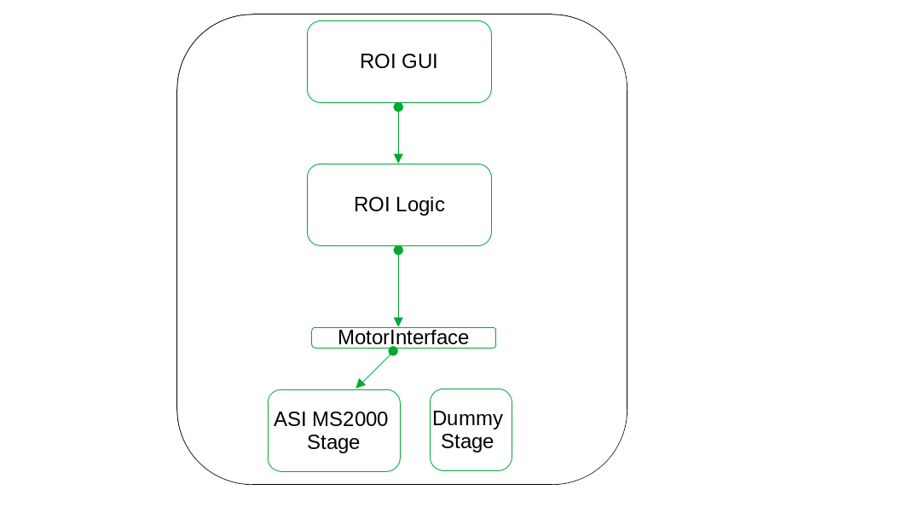

# Qudi-CBS Developer Guide

## Introduction

Qudi-CBS is a software package for the control of optical microscope setups with different hardware components. The objective is to replace the currently used LabView based software which needs to be adapted specifically to each experimental setup. Due to a modular approach, the new software is applicable to all experimental setups, using a local configuration file. The initial outline was to use Python 3 and to build the graphical user interface (GUI) with Qt, respectively its Python binding PyQt. 

The software is build into the framework of Qudi, a modular experimental control suite made accessible on Github by University of Ulm, with around 30 collaborators. Qudi is written in Python, using PyQt for the GUI, and is a good starting point to develop the required functionality. For the general context, Qudi was initially developed to control a confocal microscopy setup used for quantum optics research (color centers in diamond), its core functionality (startup code and the manager module) is derived from a neurophysiology experiment control software package (ACQ4, also on Github). The Qudi Github repository contains a detailed documentation for users as well as guidelines for contributors. For the general concepts, see also Binder et al. SoftwareX, Vol. 6, 2017, https://www.sciencedirect.com/science/article/pii/S2352711017300055?via%3Dihub. Some key points may also be referenced in this document. It was required to create a fork on Github to develop custom modules based on Qudi.

## Software architecture 

Qudi consists of a set of core modules which handle the background processes, and the so called science modules, which are specific to the the scientific application the software is used for. Within the science modules, one distinguishes between the following layers: GUI, Logic, Interface and Hardware. Inside the folder containing all Qudi code, the modules are organized into eponymous folders. (Besides these, the package also contains separate folders for configuration files (config), tools (such as the conda environment files), qtwidgets (custom subclasses of QtWidgets), artwork (logos and stylesheets), jupyter notebooks and its proper documentation). 

In the current version of Qudi-CBS, the Qudi core is used, until now without modifications. Science modules were however added or modified to better fit the requirements, especially on GUI and logic level. Some hardware modules, containing Python classes representing physical devices, have already been available and can be reused or extended if needed. Before giving a more detailed explanation of science modules, the manager module, the key part of the core, is briefly presented. 

On startup of the software, the manager module is in charge of reading a configuration file, which allows to load the science modules referenced in the configuration file. It also does error handling and logging. At the end of the event loop, the manager makes sure all devices and all modules are terminated properly. Below is shown the graphical interface which belongs to the manager module.


The manager GUI contains a display for the log messages (bottom part), an integrated iPython console (upper right part), and the list of all available modules, organized into the categories GUI, Logic and Hardware. This list of modules represents the information read from the configuration file. On startup, modules are callable but not yet loaded. It is up to the user so activate the modules needed for the experiment, by clicking the **load module** button. In case of a GUI module, this will open a new window. In case of hardware or logic modules, the module just changes its state (from not loaded to idle), and its methods are now accessible from the ipython console using the corresponding namespace. Before calling the methods from the iPython console, the user should however know the effects of the called methods, especially those with impact on the devices, or at least make sure to read the docstrings. In case of dependencies between modules (explained below), the dependent modules will also be activated with the selected module. 

The different types of the Qudi science modules represent a model-view-controller (MVC) approach. The following schematic represents the hierarchy between the layers and shows how the user can interact with them. Note that in the schematic, both devices (Hardware Device 1 and 2) represent the same type of device, for example two cameras, used interchangeably on a same or on different setups. Examples of the realization of this schematic in practical cases are shown further below.  


### Hardware level and the interface 

The hierarchically lowest level are hardware modules, corresponding to the controller in the MVC design pattern. They are drivers for the specific instruments available on a setup. They constitute the basis for communication with the devices. These modules should be able to run in a stand-alone manner inside the Qudi-framework. They 'don't know' about the presence of other modules made available to the user. Hardware modules are grouped according to the device type they represent, for example one may find a folder 'camera' containing the drivers for different camera models and brands (Andor, Hamamatsu, Thorlabs), a folder containing motorized stages, etc. 

The need to exchange the connected instrument highlights the importance of the modular structure: The local configuration file specifies which one of, for example, cameras is used on a setup. For another setup, only this camera module needs to be changed, leaving the rest of the modules (for example the logic and GUI which interact with the camera) the same. This is where the particular interest of the interface layer comes in: It represents a set of common functions that must be made available for a given device type. A device, lets say a camera of a particular brand, is a child class of the class CameraInterface, which lists all these required methods. Besides this device specific interface, all hardware modules inherit the *Base* parent class which brings in the Qt functionality and which is common for all device types. Methods of the Interface are abstract, so they must be reimplemented in the child class. Inheriting from the corresponding interface class ensures that methods called from the model layer, called logic layer in Qudi, are available.  

One can think of the interface as a kind of adapter or shifter that enables to address a given type of device, without the need that the main control program (the logic layer, see below) knows which one is physically present on the setup.  

Besides the Python classes corresponding to drivers for real devices, dummy instruments are also used. These are mock implementations inheriting from the same interface as the devices they represent, returning simulated or random values instead of physically measured ones. Due to to architecture, the logic level requires return values from the connected hardware module. The dummy instruments ensure therefore that the software runs correctly on a computer without real devices connected, for example during development or if a user wants to familiarize with the GUI functionality. 

### Logic level

To perform a complex experiment, the simple instrument driver commands need to be organized into a defined sequence. Taking again the camera example, it may be required to prepare the camera for an acquisition, set for example an adapted acquisition mode, launch the acquisition, retrieve the data and correctly terminate the acquisition, eventually resetting default values, leaving the camera in its idle state. This is the role of the logic layer in Qudi, corresponding to the 'model' in the MVC pattern. The logic can access all the methods of the hardware module which it controls.  An instance of the hardware class is created in the logic module. To be more precise, in Qudi this is handled using the configuration file (discussed in more detail below) to indicate which device is physically connected without need to modify the code, where the information from the configuration is referenced as a Connector object. As mentioned in the previous section, as all hardware classes of a given type must implement the common set of functions specified in the interface class, it is not really important for the logic module to know which device is actually present, any of them are supposed to comply with the logic. 

Special cases, such as specific functionality available only for one of the different devices of a same type, may however be handled using if-else structures in the logic module. The condition should nevertheless be queried using only the common interface methods. (Example: a user defined temperature setpoint is available for the andor iXon Ultra camera, not for the other ones (Thorlabs, Hamamatsu). A common interface method has_temp, returning a boolean True if the camera allows temperature setting, can be used to enter into the if-block to modifying the temperature. The specific method set_temperature can be called inside this if-block, else this part is omitted. This avoids raising errors due to the call to a not defined method in case the device is changed).

Besides the connections to the hardware layer, logic modules can also be connected to other logic modules (same level connections). These connections must not be recursive, that is, if module A accesses the methods in module B, module B can not access those in module A, because this would raise errors on startup as the program can not determine which module is a dependency of which other module. Note, that connection means an unidirectional information exchange, so the logic can access the hardware, but not vice versa.  

### GUI level

The setup can already be piloted using the methods of the hardware modules or, on a higher level, the methods from the logic module, which can be called from the integrated ipython console of the qudi manager module. The graphical user interface modules make it however more comfortable for the user and avoids having to memorize or search all the needed methods for an experiment. The GUI is hence the topmost level of the hierarchical architecture of Qudi. It corresponds to the 'view' layer in the MVC design pattern. In the simplest case, one GUI module connects to one logic module, which in turn pilots one instrument. But a GUI module may connect to several logic modules which are instantiated in the GUI class (the specific connection being handled via a configuration file). In accordance with the model-view approach, display functionality and actual data handling should be strictly separated between the GUI and the logic modules. GUI modules are moreover not allowed to connect to other GUIs. Logic modules are the only layer where a same level connection is allowed.  

Most GUI functionality is articulated around signals emitted by user interaction, and slots. There are signals whose slots are contained in the same GUI module (internal signals), signals whose slots are actually methods of the connected logic module ('signals to logic') and signals that are instantiated in the logic module and emitted therein, but whose slots are methods from the GUI module ('signals from logic'). In either case, the connections are defined in the GUI module. The logic module does in principle not know of the existence of the GUI. But the signals can carry information to the GUI module, if the GUI module retrieves them.

To facilitate GUI design, the Qt designer software is used. An .ui file is saved in Qt designer and imported during runtime in the GUI class. (Once prototyping is finished, the ui file import could be modified to gain in speed on activation of a module).

The documentation of Qudi gives some guidelines on GUI design, and encourages the use of toolbars and dockwidgets, which allows to hide unused functionality, making also the GUI itself modular and flexible. It can be useful to get some inspiration from the already existing modules.


## The configuration file

The configuration file contains the information which one of the science modules contained in the software package are actually instantiated. For this, the author of the configuration file specifies an identifier for the instance and indicates which class from which Python file is going to be used. The instance can then be connected to other instances following the already mentioned rules:

- GUI instances can only connect to logic instances
- Logic instances can connect (non recursively) to other Logic instances, and to hardware instances 
- Hardware instances can not connect to any other instance.

Connection means a unidirectional access to the instance. 

The configuration file uses the yaml format. It contains a section for the startup of the program, where typically the manager module and its GUI is loaded, and then the categories GUI, Logic and Hardware. This allows to sort the instances into the correct category inside the manager GUI (see Figure 1). 

The configuration file allows also to set default values for the instance. For this, a reference to an entry in the configuration file is needed in the code of the class. To build a configuration file from scratch, it is useful to know that the docstring of each science module class contains an example configuration entry, listing all required information. The code of the science module expects some information (such as default settings for a device for example) from the configuration file. It is specified in the code, if, in case this information is missing, an error is raised or if only a warning is emitted and a default value given in the code is used instead. If an error is raised, the module can not be loaded and an error message pops up. Then it is needed to modify the configuration entry to complete this important information. 

An exemplary configuration entry in the category hardware is shown here:

```
andor_ultra_camera:
    module.Class: 'camera.andor.iXon897_ultra.IxonUltra'
    dll_location: 'C:\Program Files\Andor SOLIS\Drivers\atmcd64d.dll' # path to library file
    default_exposure: 0.05  # in seconds
    default_read_mode: 'IMAGE'
    default_temperature: -70
    default_cooler_on: True
    default_acquisition_mode: 'RUN_TILL_ABORT'
    default_trigger_mode: 'INTERNAL'
```

To terminate this section, two examples of the module connections between the different layers are shown. The first example is a straight-forward connection between one GUI, with one associated Logic module, which in turn handles one device (interchangeable between the real device and the dummy instrument, using a common interface). The second example is more complex, because it involves several devices that are controlled (via the logic and interface levels) by a unique GUI module.



Example 1: Connection of the ROI selector GUI down to the motorized stage in charge of sample movement.


Example 2: Connectors of the 'toolbox' Basic Imaging GUI module. An example of a connection between logic modules is also found. The filterwheel logic needs the access to the lasercontrol logic as a safety check to allow modifying the filter settings only if the lasers are off and also checks compatibility of the laserlines for the given filter. The lasercontrol interface is implemented as a subset of functions in different types of devices, as lasercontrol is either handled by a DAQ or an FPGA. An example for an optional connector is the brightfield logic, that is not available on every setup.


## Installation 

### Windows installation

Prerequisites: 

- Install Anaconda: https://www.anaconda.com/products/individual
- Install Git for Windows: https://gitforwindows.org/
- Install a Git client, for example Git Cola: https://git-cola.github.io/
- For development, install PyCharm: https://www.jetbrains.com/pycharm/download/#section=windows

Qudi-CBS installation:

- Clone the github repository: https://github.com/NollmannLab/qudi-cbs using either the git client or git bash:
  `git clone https://github.com/NollmannLab/qudi-cbs.git`

- Open an anaconda prompt and navigate to qudi-cbs/tools: 

  `cd qudi-cbs/tools`

- Create the conda environment from file:
  `conda env create -f qudi-cbs-conda-env-win10-64bit-qt5.yml`

- Verify the creation of the environment:
  `conda env list`

  The qudi environment should now be listed there.

  On a system connected to hardware, some hardware specific Python package may need to be added (such as PIPython, Fluigent-SDK, nifpga, maybe reinstall pyserial in case of conflicts with serial module, ..). See the detailed hardware description files. This step can be done later when configuring the system.

  The anaconda prompt can now be closed. 
  In case PyCharm will be used, remember to configure the project interpreter to use the new conda environment qudi.

  Although the conda environment is the one for windows 10, it was also tested on windows 7 and worked correctly.
  
- Create a desktop shortcut to start Qudi-CBS:

  - Right click on the desktop and select new -> shortcut

  - Specify the target: 
    C:\Windows\System32\cmd.exe "/K" D:\anaconda3\Scripts\activate.bat "D:\anaconda3\envs\qudi" && cd "C:\Users\MFM\qudi-cbs" && python "start.py"
    (replacing C:\Users\MFM by the correct user name for your system. The rest should be ok if default locations were used for anaconda installation.)

    General format:

    C:\Windows\System32\cmd.exe "/K" <path-to-activation-script> "<path-to-qudi-environment>" && cd "<path-to-qudi-directory>" && python "start.py"

  - Click 'next' and specify the name for the shortcut such as Qudi-CBS 

  - Click 'finish'

  - Set an icon (for example using the one from Qudi original version located at qudi-cbs\artwork\logo\logo_qudi.ico )


Further information on how to install Qudi on Linux and Windows can be found here (as well as a detailed description on how to create the desktop shortcut for windows): 

https://ulm-iqo.github.io/qudi-generated-docs/html-docs/installation.html

(For Windows installation, note that TortoiseGIT is optional, and PyCharm only needs to be installed for development (but any other Python editor can also be used). Anaconda3 is strongly recommended.)


On first start, qudi will open using a default configuration file. In the manager GUI, click Menu -> Load configuration and then choose config_dummy.cfg in the folder custom_config. 


### Linux installation

Prerequisites: 

- Install Anaconda: https://www.anaconda.com/products/individual
- Git should already be included in the Linux distribution. To test this, open a terminal and run git --version.
- Optional: Install a Git client, for example Git Cola: https://git-cola.github.io/
- For development, install PyCharm: https://www.jetbrains.com/fr-fr/pycharm/download/#section=linux

Qudi-CBS installation:

- Clone the github repository: https://github.com/fbarho/qudi-cbs using either the git client or a terminal.
  `git clone https://github.com/NollmannLab/qudi-cbs.git`

- In the terminal, navigate to qudi-cbs/tools: 

  `cd qudi-cbs/tools`

- Create the conda environment from file:
  `conda env create -f qudi-cbs-conda-env-linx64-qt5.yml`  

- Verify the creation of the environment:
  `conda env list`

  The qudi environment should now be listed there.

  On a system connected to hardware, some hardware specific Python package may need to be added (such as PIPython, ..). See the detailed hardware description files. This step can be done later when configuring the system.

  In case PyCharm will be used for development, remember to configure the project interpreter to use the new conda environment qudi.


### Starting Qudi-CBS

On **Windows**, it is preferable to create a desktop shortcut, specifying the path to conda activation script, the location of the conda environment, the path to the startup file of Qudi. (as explained above). As an alternative, start PyCharm, open qudi-cbs\start.py and execute this file.

On **Linux**: Activate the conda environment, navigate to the folder Qudi-CBS and run python start.py. 

In a terminal, run:

`conda activate qudi`

`cd qudi-cbs`

`python start.py`


## Documentation of Qudi-CBS science modules

The original version of Qudi contains many modules for any of the categories GUI, Logic and Hardware discussed above, with an own documentation partially available. The following table gives an overview of modules that were specifically created for the optical microscopy applications covered by Qudi-CBS, or strongly modified from their original version. The ones that are part of Qudi-CBS, not significantly modified, and existed already in Qudi are labeled with an asterisk. Modules that build on top of an already available module in Qudi, are labeled with two asterisks.


| GUI modules                 | Logic modules                 | Interface modules          | Hardware modules                  |
| --------------------------- | ----------------------------- | -------------------------- | --------------------------------- |
| Basic Imaging GUI           | camera_logic2                 | brightfield_interface      | camera_dummy**<br />              |
| Focus Tools GUI             | filterwheel_logic             | camera_interface**         | hamamatsu_camera                  |
| ROI Selector GUI            | lasercontrol_logic            | filterwheel_interface      | thorlabs_camera*<br />            |
| Fluidics Control GUI        | brightfield_logic             | lasercontrol_interface     | andor_camera**                    |
| Injections Configurator GUI | focus_logic<br />             | microfluidics_interface    | dummy_filter_wheel                |
| Experiment Configurator GUI | autofocus_logic_camera        | motor_interface*           | dummy_no_filter                   |
| Taskrunner GUI*             | autofocus_logic_fpga<br />    | valve_positioner_interface | thorlabs_motorized_filter_wheel** |
|                             | roi_logic                     |                            | thorlabs_fast_filter_wheel        |
|                             | valve_logic                   |                            | dummy_daq                         |
|                             | flowcontrol_logic             |                            | national_instruments_daq          |
|                             | daq_logic                     |                            | mcc_daq                           |
|                             | positioning_logic             |                            | brightfield_dummy                 |
|                             | injections_logic              |                            | motor_dummy*                      |
|                             | experiment_configurator_logic |                            | mcl_nanodrive<br />               |
|                             | taskrunner*                   |                            | pifoc<br />                       |
|                             |                               |                            | motor_asi_ms2000                  |
|                             |                               |                            | pi_3axis_stage<br />              |
|                             |                               |                            | valve_dummy                       |
|                             |                               |                            | hamilton_valve<br />              |
|                             |                               |                            | flowboard_dummy                   |
|                             |                               |                            | fluigent_flowboard<br />          |
|                             |                               |                            | ni_fpga                           |
|                             |                               |                            | lumencor_celesta                  |
|                             |                               |                            |                                   |
|                             |                               |                            |                                   |


The following table gives an overview of all tasks written for Qudi-CBS. A task is a special type of logic module that allows to run an experiment that involves the precise interaction of many devices. 

| Task name                              | Setup    | Verified ?                                                   |
| -------------------------------------- | -------- | ------------------------------------------------------------ |
| Multicolor Imaging Task PALM           | PALM     | **OK**                                                       |
| Muticolor Scan Task PALM               | PALM     | **OK**                                                       |
| ROI Multicolor Scan Task PALM          | PALM     | **OK** -> but problem with z position file saving to be solved (data format retrieved from hardware) |
| Timelapse Task PALM                    | PALM     | **OK** not yet with control if laser - filter combinations ok |
| -------------------------------------- |          |                                                              |
| Multicolor Scan Task RAMM              | RAMM     | **OK**                                                       |
| ROI Multicolor Scan Task RAMM          | RAMM     | **OK**                                                       |
| Fluidics Task RAMM                     | RAMM     | **OK**                                                       |
| Hi-M Task RAMM                         | RAMM     | **OK**                                                       |
| Photobleaching Task RAMM               | RAMM     | **OK**                                                       |
| Timelapse Task RAMM                    | RAMM     | **OK**                                                       |
| Fast Timelapse Task RAMM               | RAMM     | **OK** in current version but needs optimization to speed things up. metadata when using tif ? |
| -------------------------------------- |          |                                                              |
| Multicolor Scan Task Dummy             | -        | **OK**                                                       |
| Hi-M Task Dummy                        | -        | **OK**                                                       |
| Timelapse Task Dummy                   | -        | **OK**  (simulation as for RAMM Timelapse task)              |
| Fast Timelapse Task Dummy              | -        | **OK** <br /> (metadata when using tif?)<br />When testing, reduce waiting time after movement for motor dummy because piezo movement would be simulated much too slow |
| -------------------------------------- |          |                                                              |
| Fluidics Task Airyscan                 | Airyscan | **OK**                                                       |
| Hi-M Task Airyscan                     | Airyscan | **prepared** (see to do list in module)                      |
| Confocal Hi-M Task Airyscan            | Airyscan | to create                                                    |
| Mock Hi-M Task Airyscan                | Airyscan | **OK** (needs new tests on experimental setup)               |


In the next sections, some information relevant for development for the modules listed in the table above is given.

### GUI

A detailed description of GUI functionality can be found in the Qudi-CBS userguide.

The general workflow for setting up a GUI module is as follows:

- Prototype the GUI elements (widgets) using Qt designer, following Qudi GUI guidelines (or trying to be consistent with the already existing GUIs). Although the naming convention used for the widgets leads to relatively long names, it is useful to stick to it for consistency. Moreover, searching for the widget names  in a file is rather easy due to uniqueness.
- In the Python file, create a class (Mainwindow class) that loads the .ui file created in Qt designer.
- Create classes for dialogwindows etc. 
- Create a class for the GUI, where the Mainwindow class (and the dialogwindows if applicable) are used. Define the connectors to the dependent modules and set up all signal-slot connections. 


Further comments to the modules that may be useful for development:

#### Basic Imaging GUI

The number of displayed laser control elements in the laser dockwidget adapts as a function of the number of lasers given in the configuration file. Up to 8 lasers are currently supported. 

Connectors: CameraLogic, LasercontrolLogic, FilterwheelLogic, and optional BrightfieldLogic

The close function of the Mainwindow is reimplemented to stop continuous processes such as the live image or the laser-on state when the mainwindow is closed.


#### Focus GUI

Connector: FocusLogic

The display elements on this GUI adapt depending on the hardware used for the autofocus control. For QPD based readout of the IR reflection signal, the thresholded image is hidden, for camera based readout, it is shown. In case a 3 axes motorized stage is available, autofocus using a reference plane at a distance 'offset' below the sample surface plane, is made available. 

The close function of the Mainwindow is reimplemented to stop continuous processes such as the autofocus.


#### ROI GUI

Connector: RoiLogic

The close function of the Mainwindow is reimplemented to stop the continuous tracking mode of the stage position when the mainwindow is closed. 


#### Fluidics Control GUI

This interface allows to handle all the devices needed for the *in-situ* Hybridization.

Connectors: ValveLogic, FlowcontrolLogic, PositioningLogic

The number of displayed valve control elements depends on the number of configured valve positionners given in the configuration file. 


#### Injection Configurator GUI

Connector: InjectionsLogi


#### Experiment Configurator GUI

This GUI allows to configure a Qudi task with all the necessary experimental parameters that are saved in a specific file where the task retrieves these parameters.

Connectors: ExpConfigLogic

The form displayed on this GUI adapts to match the necessary parameters that the user needs to indicate. All widgets are created in Qt Designer, and displayed or hidden depending on the experiment that is selected from a dropdown menu. 


### Logic modules

#### camera_logic2

- Connector: CameraInterface
- continuous processes (live image, display during live video) are handled using worker threads
- contains the low level functions to access some basic settings from camera hardware, but also the more complex methods to handle camera acquisitions, and methods that are specifically used during tasks (see below). Methods for data handling are also available in this module

#### filterwheel_logic

- Connectors: FilterwheelInterface, LaserControlLogic

#### lasercontrol_logic

- Connector: LaserControlInterface (which can be implemented in a DAQ module, an FPGA, or planned in Lumencor Celesta)
- The controllertype (DAQ, FPGA, Lumencor) needs to be specified in the configuration file, to select the right case in methods if there are variations due to the quite different way the devices operate
- There is a small set of controller specific methods available in this module. For example, the FPGA requires a specific preparation when running a task which is not applicable for a DAQ or Lumencor. This method can for example be found in the lasercontrol_logic.

#### brightfield_logic

- Connector: BrightfieldInterface

#### focus_logic

- Connector: MotorInterface (for Piezo controller), AutofocusLogic
- This module handles the manual focus and makes a link to the autofocus_logic which is a different implementation depending on the used devices. 
- Continuous processes (piezo position timetrace, camera live image for IR reflection signal, autofocus, ) are handled using worker threads. 
- Three methods are typically available for the continuous processes: start the process, perform a step ('run' or 'loop'), and stop the process

#### autofocus_logic_camera

- Connector: CameraInterface

#### autofocus_logic_fpga

- Connector: MotorInterface (for 3 axes stage), CameraInterface (just as visual feedback), Base (for FPGA, the autofocus related functions are not regrouped into a specific interface here, so the connector just needs to satisfy reimplementing the Base class which is the case for all hardware)

#### roi_logic

- This module was inspired from the Qudi POI manager logic module, and contains classes that are similar to the ROI and POI (point of interest) terminology used in Qudi. Due to different requirements, the level of organization is in RegionOfInterestLists and RegionsOfInterest (ROIs)
- An interesting additional feature would be a camera image overlay
- Connector: MotorInterface (motorized stage)

#### valve_logic

- Connector: ValvePositionerInterface

#### flowcontrol_logic

- Connector: MicroFluidicsInterface (for the flowboard), DAQLogic (to control the DAQ that controls the peristaltic pump)
- This module could be (easily?) extended to support multiplexing when more channels are configured on a flowboard

#### daq_logic

- A flexible module that regroups all possible functionality of DAQ devices (except Lasercontrol wihich is handled in a dedicated module) in either low-level functions or for more comfortable use, as predefined functions for a specific functionality.
- Connector: Base (for DAQ without a set of specific interface functions)
- To be compatible with this module, DAQ hardware modules should be compliant with certain function calls and parameters. A combination with an interface level should be envisaged in the future. 

#### positioning_logic

- Handles the 3 axes positioning of a needle for the fluidics injections. Coordinate systems where the probes are located are quite setup specific. If this module is to be used on another setup, a new coordinate system might be necessary.
- Connector: MotorInterface
- A safety mechanism controls the way movements are made. All movements are done in a z safety plane to avoid hitting the needle against the probe tray. 
- Movements are continuous processes (using worker threads), so that is is possible to stop or interrupt a movement.

#### injections_logic

- No connectors, this is a module to create a yml file containing the information needed for an injection sequence. 
- Works with ListModels

#### experiment_configurator_logic

- Connectors: CameraInterface, LaserControlLogic, FilterwheelLogic 
- The connectors are needed to comfortably retrieve the current settings or to determine which lightsources are available
- Apart from this, this module does not interact with the hardware. Its purpose is to write the configuration files needed for tasks (see below)
- If new tasks are added, this module, as well as the Experiment Configurator GUI, can easily be extended to make the configurator available for the new tasks. See comments in the code. 
- Note the different listmodels used for the usual experiments (imaging sequences defined simply by the lightsource and the corresponding intensity), and the timelapse experiments (where imaging sequences may additionally be defined by different parameters for the z stacks and, additionally, filter settings may change from one set to the next one).

#### Tasks 

Tasks represent a subcategory of logic modules. They allow to define the steps that need to be performed for a complex or lengthy experiment, where the interaction of several hardware devices is required. Tasks are based on a state machine, that allows possible transitions between stopped, running, pausing, etc. Task modules need to fit a specific format so that they can be handled by the taskrunner module. Notably, tasks need to reimplement the following methods:

- startTask: preparative steps that will be executed once at the start of the task, including security checks if all conditions are set to perform the task
- runTaskStep: a sequence of commands that is repeated at least once, but typically several times, to perform an experiment. 
- pauseTask: possible implementation of what needs to be done to send the task to a pause
- resumeTask: possible implementation of what needs to be done when resuming a task after a pause (typically the inverse what was done in pauseTask)
- cleanupTask: steps to reset the devices to a proper state after finishing the task. Often the reverse of what was done in startTask.

In Qudi-CBS, there are, besides these five required methods, some helper functions that read for example the parameters for the experiment from a file. In the current version, functions that are the same for all tasks and that are used recurrently, are imported from the file task_helper_functions, although not yet done consistently (this could be improved). (This does not concern the load_user_parameters because this is often very specific to the task under consideration.) 


### Hardware modules

Hardware modules contain classes that represent the physical device. Many of them need specific python packages to be installed into the qudi environment. See the hardware documentation files for the different experimental setups. 

